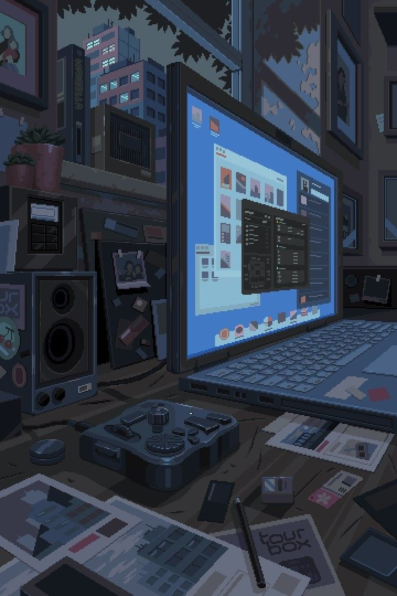

Subject: [test attempt and analysis feature]
Background environment: [a guy on study desk attempting osmium generated tests on pc, interior room]

### Core idea:
 its about osmium help students to *practice smartly* and in better direction to crack their exam.

	strictly don't sound negative and cheap.

#Title: YOU just practice, osmium will elevate you and get prepared you for your goal exam.

**DESIGN IDEAS:** 
PERSON ABOUT TO FINISHES HIS TEST ATTEMPT AND A BIG CURSOR SHOWING ON MONITOR HE IS CLICKING ON SUBMIT, THE INTERCATION SCENE CAMERA ANGLE SHOULD BE *CINEMATIC AND EXPRESSIVE.*
THE FLOATING UI OF OF  SCORE AND RESULT ANALYSIS OF TEST WILL BE SHOWN. 
A BOLD BIGGER FONT OF TITLE AND A BODY

#artstyle: Medium fidelity *2d* with rich colours.

REFERENCES:

